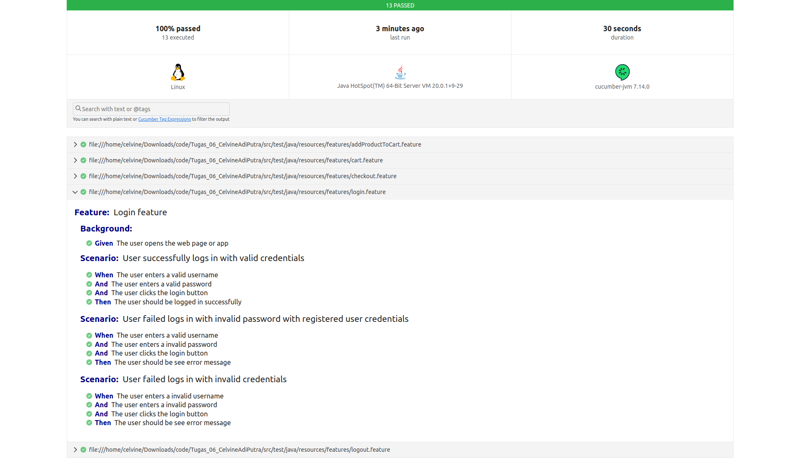
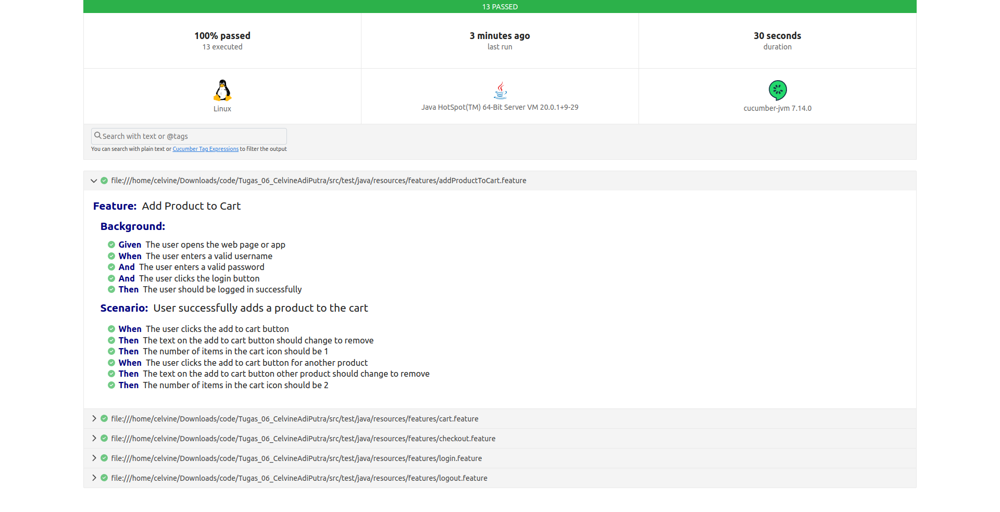
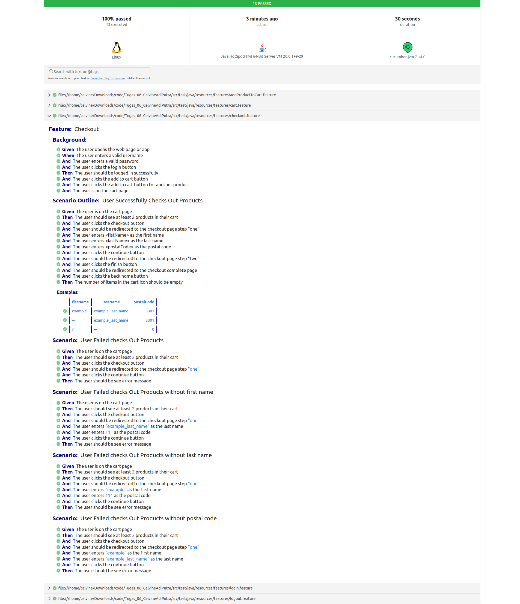

# Homework 06 | Celvine Adi Putra

### JDK Version

JDK : 20

### Dependency

| No | Group Id                | Artifact Id            | Version |
|----|-------------------------|------------------------|---------|
| 1  | org.seleniumhq.selenium | selenium-java          | 4.10.0  |
| 2  | org.junit.jupiter       | junit-jupiter-api      | 5.10.0  |
| 3  | io.github.bonigarcia    | webdrivermanager       | 5.5.3   |
| 4  | io.cucumber             | cucumber-java          | 7.14.0  |
| 5  | io.cucumber             | cucumber-junit         | 7.14.0  |
| 6  | org.junit.platform      | junit-platform-console | 1.10.0  |

### Test Information

1. URL

```text
https://www.saucedemo.com/
```

2. Users

| Username      | Password      |
|---------------|---------------|
| standard_user | secret_sauce  |
| fake_user     | fake_password |

### Report

#### Login Feature



```gherkin
Feature: Login feature

  Background:
    Given The user opens the web page or app

  Scenario: User successfully logs in with valid credentials
    When The user enters a valid username
    And The user enters a valid password
    And The user clicks the login button
    Then The user should be logged in successfully

  Scenario: User failed logs in with invalid password with registered user credentials
    When The user enters a valid username
    And The user enters a invalid password
    And The user clicks the login button
    Then The user should be see error message

  Scenario: User failed logs in with invalid credentials
    When The user enters a invalid username
    And The user enters a invalid password
    And The user clicks the login button
    Then The user should be see error message
```

#### Add Product to Cart



```gherkin
Feature: Add Product to Cart

  Background:
    Given The user opens the web page or app
    When The user enters a valid username
    And The user enters a valid password
    And The user clicks the login button
    Then The user should be logged in successfully

  Scenario: User successfully adds a product to the cart
    When The user clicks the add to cart button
    Then The text on the add to cart button should change to remove
    Then The number of items in the cart icon should be 1
    When The user clicks the add to cart button for another product
    Then The text on the add to cart button other product should change to remove
    Then The number of items in the cart icon should be 2
```

#### Cart


```gherkin
Feature: Remove Items from Cart

  Background:
    Given The user opens the web page or app
    When The user enters a valid username
    And The user enters a valid password
    And The user clicks the login button
    Then The user should be logged in successfully
    Then The user clicks the add to cart button
    Then The user clicks the add to cart button for another product

  Scenario: Remove an Item from the Cart
    Given The user is on the cart page
    Then The user should see at least 2 products in their cart
    When The user clicks the remove button for the first item
    Then The number of items in the cart icon should be 1
    Then The user should see at least 1 products in their cart
    When The user clicks the remove button for the first item
    Then The shopping cart should be empty
```

#### Checkout



```gherkin
Feature: Checkout

  Background:
    Given The user opens the web page or app
    When The user enters a valid username
    And The user enters a valid password
    And The user clicks the login button
    Then The user should be logged in successfully
    And The user clicks the add to cart button
    And The user clicks the add to cart button for another product
    And The user is on the cart page

  Scenario Outline: User Successfully Checks Out Products
    Given The user is on the cart page
    Then The user should see at least 2 products in their cart
    And The user clicks the checkout button
    And The user should be redirected to the checkout page step "one"
    And The user enters <fistName> as the first name
    And The user enters <lastName> as the last name
    And The user enters <postalCode> as the postal code
    And The user clicks the continue button
    And The user should be redirected to the checkout page step "two"
    And The user clicks the finish button
    And The user should be redirected to the checkout complete page
    And The user clicks the back home button
    Then The number of items in the cart icon should be empty

    Examples:
      | fistName | lastName          | postalCode |
      | example  | example_last_name | 3301       |
      | ---      | example_last_name | 3301       |
      | ?        | ---               | 0          |
```
